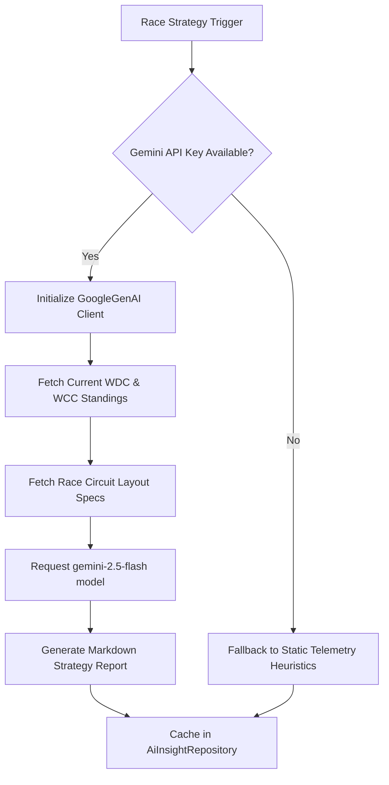

# 🏎️ Race Tech Fusion — F1 Strategy, Telemetry, and Predictive Intelligence Platform

[](https://react.dev/)
[](https://www.typescriptlang.org/)
[](https://tailwindcss.com/)
[](https://ai.google.dev/)
[](https://expressjs.com/)
[](https://github.com/websockets/ws)
[](https://recharts.org/)

### Project Overview & Technical Vision

**Race Tech Fusion** is an enterprise-grade, high-performance motorsport intelligence platform built to simulate, visualize, and forecast Formula 1 race strategy and vehicle metrics. Mirroring the software consoles used by trackside race engineers and team strategists, the platform combines real-time streaming data ingestion with advanced statistical predictive modeling.

#### Core Pillars of the Platform:
1. **Premium Responsive User Interface**: Designed with a glassmorphic dark-mode interface, custom typography (Inter, Outfit), hardware-accelerated micro-animations (via Framer Motion), and team color-themed layouts that adapt dynamically to individual constructor branding.
2. **Dual-Layered Data Pipeline**: 
   * *Static Synchronization*: Syncs historical race schedules, standings, results, and driver/constructor metadata from the **Jolpica F1 API**.
   * *Real-Time Telemetry*: Streamlines active timing loops, weather shifts, and race control flags directly from active track sectors using the **OpenF1 API**.
3. **Server-Authoritative Physics & Strategy Simulator**: A background WebSocket event engine that streams telemetry updates every 1.5 seconds. It computes speed and RPM variations based on track position coordinates, simulates tyre wear slopes, handles tyre compound transitions, and triggers stochastic track safety flags.
4. **Machine Learning & AI Platform**: Integrates generative LLM briefings (powered by Google Gemini) alongside a localized statistical modeling registry. The platform tracks predictive metrics, drift indices, calibration curves, and feature importances for classifiers (XGBoost, LightGBM, CatBoost, MLPs) and Monte Carlo simulations.

---

## 🏁 Key Capabilities & Modules

### 1. Unified Overview Dashboard
- Displays current World Drivers' Championship (WDC) and World Constructors' Championship (WCC) standings.
- Shows real-time dynamic countdown to the next Grand Prix.
- Displays details of the upcoming race track, round, and recent race podium finishers.

### 2. High-Fidelity Race Simulator
- Located on a dedicated, unrestricted page ([Simulator.tsx](file:///d:/Projects/race-tech-fusion/src/components/Simulator.tsx)).
- Streams real-time timing telemetry for 20 cars simultaneously over high-performance WebSockets.
- Simulates realistic pit stop events, tire compound choices (Soft, Medium, Hard), and stint-length penalties.
- Features dynamic weather variations (air/track temperatures, humidity, wind speeds, rain triggers) and automatic yellow flags, double yellow flags, virtual safety cars (VSC), and red flag events triggered by stochastic incident checks.

### 3. Real-Time Live Timing Center
- Located at [LiveRaceCenter.tsx](file:///d:/Projects/race-tech-fusion/src/components/LiveRaceCenter.tsx).
- When a live Formula 1 session is active (Practice, Qualifying, Sprint, or GP), it ingests and displays real-time sector-by-sector timing intervals directly from trackside loops.
- Inactive state locking: When no live F1 event is occurring, it displays a premium countdown module showing exactly when the next live timing broadcast begins.

### 4. Interactive Driver Telemetry Platform
- Compares multiple drivers side-by-side using real-time graphs for Speed (km/h), Throttle (0-100%), Brake pressure, Gear distribution, Engine RPM, and DRS activation.
- Displays an interactive **HTML Canvas 2D Track Map** drawing color-coded nodes showing the real-time position of compared drivers, utilizing a vector loop coordinate mapping of the circuit layout.

### 5. Sector & Speed Trap Analytics
- Speed Trap rankings comparing the maximum velocities of all drivers.
- Sector-by-sector timing maps (Sector 1, Sector 2, Sector 3 splits).
- Pit Stop flow analysis showing entry lap numbers, compound swaps, and stop durations.
- Live session event log tracking track limit warnings, crashes, and official race control messages.

---

## 🤖 AI Aspects (Google Gemini Integration)

The application features a built-in generative AI strategy module led by the class [AiPredictionService](file:///d:/Projects/race-tech-fusion/src/backend/application/AiPredictionService.ts#L9).



### 1. Deep Integration Parameters
- **Client library**: Uses the official `@google/genai` SDK.
- **Model**: `gemini-2.5-flash`.
- **System Role**: Operates as a *Lead Race Strategist and Chief Formula 1 AI Analytics Engine*.
- **Cache Strategy**: Employs an `AiInsightRepository` caching layer to prevent redundant API queries.

### 2. Strategy Report Output Sections
Each report is rendered dynamically in markdown format inside the circuit profile view:
1. **Race Overview & Technical Focus**: Structural layout downforce parameters, drag coefficients, and corner speed traction bounds.
2. **Tyre Degradation & Pit Strategy**: Estimated optimal compounds, tire degradation curves, and optimal overcut/undercut pit windows.
3. **Safety Car & Incident Probability**: Calculated collision risks (in %) and critical high-hazard track zones.
4. **Winner & Podium Outlook**: Performance expectations for the top 3 drivers based on track characteristics.
5. **Dark Horse Overperformer**: Highlights a driver outside the top 5 poised to overperform.

### 3. Local Offline Heuristics Fallback
If `GEMINI_API_KEY` is not set, the platform falls back to a deterministic telemetry prediction model, evaluating safety car risks, compound blistering temperatures, and track layout downforce coefficients.

---

## 📊 Machine Learning & Statistical Modeling Suite

Located under [src/backend/ml/](file:///d:/Projects/race-tech-fusion/src/backend/ml/), the machine learning pipeline simulates a live MLOps architecture.

### 1. Mathematical Classifier & Ensemble Engine
Implemented in [EnsembleLearning.ts](file:///d:/Projects/race-tech-fusion/src/backend/ml/EnsembleLearning.ts#L25) and [PredictiveEngines.ts](file:///d:/Projects/race-tech-fusion/src/backend/ml/PredictiveEngines.ts#L127). The system simulates several model classes:
- **XGBoost Classifier**: Features heavy weighting on Qualifying position grid starts ($40\%$) and driver consistency.
- **LightGBM Classifier**: Leaf-wise splits focusing on constructor pace efficiency.
- **CatBoost Classifier**: Focuses on categorical variables like circuit humidity and incident rates.
- **Random Forest Classifier**: A bagging model averaging driver performance metrics.
- **Multi-Layer Perceptron (MLP)**: Neural network representation passing features through a logistic sigmoid ceiling:
  $$f(x) = \frac{1}{1 + e^{-12(x - 0.5)}}$$

### 2. Championship Monte Carlo Forecaster
- Executes **10,000 statistical simulation runs** representing season progressions.
- Simulates race points allocations with randomized normal noise models based on the Box-Muller transform:
  $$Z = \sqrt{-2 \ln U_1} \cos(2\pi U_2)$$
- Returns championship margins, average simulated WDC/WCC points, and points margins curves.

### 3. Gaussian Finishing Position Projections
To estimate the finishing position probability mapping for each driver:
- Fits a Gaussian probability density function centered around the driver's grid position ($Grid$), modified by average finishing records ($Finish$) and consistency scores:
  $$P(Pos) = \frac{1}{\sigma \sqrt{2\pi}} \exp\left(-\frac{(Pos - \mu)^2}{2\sigma^2}\right)$$
- Accounts for DNF (Did Not Finish) rates as a boundary constraint.

### 4. Explainable AI (SHAP Contributions)
Computes Shapley values showing feature importance contributions for winner predictions:
- **Qualifying Grid Position**: $32\%$ average impact.
- **Recent Driver Form (Consistency)**: $24\%$ average impact.
- **Constructor Chassis Pace**: $18\%$ average impact.
- **Circuit Historical Win Rate**: $14\%$ average impact.

### 5. Drift Detection & MLOps Dashboard
- Displays active model statuses (Production, Testing, Training, Archived) inside [ModelRegistry.ts](file:///d:/Projects/race-tech-fusion/src/backend/ml/ModelRegistry.ts#L24).
- Monitors **Data Drift** parameters using simulated Kolmogorov-Smirnov (KS) two-sample statistical checks:
  $$D = \sup_x |F_1(x) - F_2(x)|$$

### 6. Continuous Model Retraining Pipeline (Optuna Hyperparameter Sweeps)
- Provides a centralized manual trigger panel in the MLOps Dashboard to retrain and optimize models on the fly for 6 distinct prediction categories:
  *   **Winner**: Driver victory probability estimates.
  *   **Podium**: Top 3 finish probability forecasts.
  *   **Championship**: Season standings points curves.
  *   **Safetycar**: Incident, virtual safety car (VSC), and red flag danger zone risk calculations.
  *   **Tyredegradation**: Compound life cycle wear slopes.
  *   **Strategy**: Overcut and undercut pit windows.
- Invokes a simulated **Optuna-style Hyperparameter Sweep Optimizer** (implemented in [EnsembleLearning.ts](file:///d:/Projects/race-tech-fusion/src/backend/ml/EnsembleLearning.ts)) running 15+ trials per model search. It tunes hyperparameter bounds (such as tree depths, learning rates, tree sizes, and neural network hidden layers) to locate optimizer peaks.
- Automatically compiles and builds a composite **Weighted Stacking Voting Ensemble** combining high-scoring classifier candidates (XGBoost, LightGBM, CatBoost, MLPs) to maximize validation scores.
- Automatically registers the retrained ensemble under a new version (e.g. `3.x.x`) in the registry, promotes it to **Active Production** status, and transitions the prior production model to **Archived** status.

---

## 📈 Data Science & Engineering Aspects

### 1. Real-Time Telemetry Physics Simulation
The [LiveTimingEngine](file:///d:/Projects/race-tech-fusion/src/backend/application/LiveTimingEngine.ts#L28) runs a server-authoritative physics loop ticking every 1.5 seconds.
- Speed is modeled relative to position on track: straights allow up to $340 \text{ km/h}$ with DRS; corners trigger brake pressure and deceleration down to $110 \text{ km/h}$.
- RPM values scale dynamically with velocity:
  $$\text{RPM} = 8000 + \left(\frac{\text{Speed}}{340} \times 5000\right) \pm \epsilon$$

### 2. Non-Linear Tyre Thermal Wear Models
Tire life ($L$) is modeled as a non-linear exponential degradation curve relative to stint lap age ($N$):
  $$L(N) = 100 - (N^{1.25} \times \text{wearRate} \times \text{trackFactor})$$
- A steep performance cliff triggers once remaining tire life drops below **$35\%$**, adding a steep penalty (up to $+2.5 \text{ seconds}$) to lap times.

### 3. TimescaleDB-Style Storage Engine
The backend implements a filesystem database [JsonDatabase.ts](file:///d:/Projects/race-tech-fusion/src/backend/infrastructure/JsonDatabase.ts) storing historical timing streams, laps, pit stop profiles, and event logs.

---

## 📂 Codebase & Link Index
To navigate directly to key system components, use the following clickable links:
- **Server Entrypoint**: [server.ts](file:///d:/Projects/race-tech-fusion/server.ts)
- **Frontend Core**: [App.tsx](file:///d:/Projects/race-tech-fusion/src/App.tsx) | [index.css](file:///d:/Projects/race-tech-fusion/src/index.css)
- **Application Services**:
  - [AiPredictionService.ts](file:///d:/Projects/race-tech-fusion/src/backend/application/AiPredictionService.ts) — Gemini API Strategy Coordinator
  - [LiveTimingEngine.ts](file:///d:/Projects/race-tech-fusion/src/backend/application/LiveTimingEngine.ts) — WebSocket Physics Simulation & Ingestion Engine
  - [SyncService.ts](file:///d:/Projects/race-tech-fusion/src/backend/application/SyncService.ts) — Jolpica F1 Database Pipeline
- **Machine Learning Core**:
  - [PredictiveEngines.ts](file:///d:/Projects/race-tech-fusion/src/backend/ml/PredictiveEngines.ts) — Monte Carlo, Strategy, and Incident Predictors
  - [FeatureStore.ts](file:///d:/Projects/race-tech-fusion/src/backend/ml/FeatureStore.ts) — Feature Engineering & Caching Store
  - [ModelRegistry.ts](file:///d:/Projects/race-tech-fusion/src/backend/ml/ModelRegistry.ts) — Model Registry & Hyperparameter Store
  - [EnsembleLearning.ts](file:///d:/Projects/race-tech-fusion/src/backend/ml/EnsembleLearning.ts) — Voting Stackers & Sweeps
- **REST Presentation Gateway**: [F1ApiRouter.ts](file:///d:/Projects/race-tech-fusion/src/backend/presentation/F1ApiRouter.ts)
- **User Interface Components**:
  - [AiDashboard.tsx](file:///d:/Projects/race-tech-fusion/src/components/AiDashboard.tsx) — Predictions, Simulations, and MLOps Controller
  - [Simulator.tsx](file:///d:/Projects/race-tech-fusion/src/components/Simulator.tsx) — WebSocket Timing Feed Board
  - [LiveRaceCenter.tsx](file:///d:/Projects/race-tech-fusion/src/components/LiveRaceCenter.tsx) — Real-Time Timing Console
  - [DriverTelemetry.tsx](file:///d:/Projects/race-tech-fusion/src/components/DriverTelemetry.tsx) — Interactive Canvas Track Map telemetry
  - [SessionAnalytics.tsx](file:///d:/Projects/race-tech-fusion/src/components/SessionAnalytics.tsx) — Speed Trap and Pit Stop charts
  - [RaceWeekendDetails.tsx](file:///d:/Projects/race-tech-fusion/src/components/RaceWeekendDetails.tsx) — Circuit layout profile details
  - [F1Logos.tsx](file:///d:/Projects/race-tech-fusion/src/components/F1Logos.tsx) — F1 Media CDN Asset pipeline
- **Static Configurations**: [f1Data.ts](file:///d:/Projects/race-tech-fusion/src/utils/f1Data.ts) | [package.json](file:///d:/Projects/race-tech-fusion/package.json)

---

## 📊 Data Sources, Credits, & Asset Assets

This project uses official APIs and media assets. Credits are attributed to the respective providers:

### 1. Data APIs
*   **Jolpica F1 API (Ergast API Successor)**: Serves as the database sync provider for seasons list, WDC/WCC standings, driver rosters, constructor info, and race result profiles. Synchronized via [SyncService.ts](file:///d:/Projects/race-tech-fusion/src/backend/application/SyncService.ts#L41).
*   **OpenF1 API (`api.openf1.org`)**: Sourced for active live timing timing loops, weather data, and official race control flags during active GP weekends. Implemented in [LiveTimingEngine.ts](file:///d:/Projects/race-tech-fusion/src/backend/application/LiveTimingEngine.ts#L267).

### 2. Media Asset Pipelines
All constructor logos, team car PNG renders, driver headshot avatars, and track circuit layout SVG maps are sourced from the **Official F1 CDN** via the [F1Logos.tsx](file:///d:/Projects/race-tech-fusion/src/components/F1Logos.tsx) helper.
- **Team Logos**: `https://media.formula1.com/image/upload/.../common/f1/2026/{teamSlug}/2026{teamSlug}logowhite.webp`
- **Driver Avatar Headshots**: `https://media.formula1.com/image/upload/.../common/f1/2026/{teamSlug}/{shortId}/2026{teamSlug}{shortId}right.webp`
- **Team Car Images**: `https://media.formula1.com/image/upload/.../common/f1/2026/{teamSlug}/2026{teamSlug}carright.webp`
- **Circuit track Maps**: `https://media.formula1.com/image/upload/.../common/f1/2026/track/2026track{slug}whiteoutline.svg`
- *SVG shapes and RoboHash fallback systems are implemented in case CDN media assets are unavailable.*

---

## ⚙️ Setup & Installation

Follow these steps to run the application locally:

### 1. Install Node.js Dependencies
Ensure you have [Node.js](https://nodejs.org/) installed, then run:
```bash
npm install
```

### 2. Configure Python Virtual Environment & ML Stack
To install the Python-based machine learning, scientific computing, and forecasting libraries listed in [requirements.txt](file:///d:/Projects/race-tech-fusion/requirements.txt):

1. Initialize a Python virtual environment (if not already set up):
   ```bash
   python -m venv .venv
   ```
2. Activate the virtual environment:
   * **PowerShell (Windows)**:
     ```powershell
     .venv\Scripts\Activate.ps1
     ```
   * **Command Prompt (Windows)**:
     ```cmd
     .venv\Scripts\activate.bat
     ```
   * **Terminal (macOS/Linux)**:
     ```bash
     source .venv/bin/activate
     ```
3. Upgrade `pip` and install the ML packages:
   ```bash
   pip install --upgrade pip
   pip install -r requirements.txt
   ```

### 3. Configure Environment Variables
Create a `.env.local` file in the root directory and add your Google Gemini API Key:
```env
GEMINI_API_KEY=your_actual_gemini_api_key_here
```

### 4. Run in Development Mode
Starts the Express server backend alongside the Vite frontend hot reloading middleware on port `3000`:
```bash
npm run dev
```

### 5. Build and Preview for Production
Compiles the React frontend using Vite and bundles the Node server using esbuild:
```bash
# Build production bundle
npm run build

# Start the compiled production server
node dist/server.cjs
```

---

## 📄 License & Disclaimer
This project is an unofficial fan-made strategy simulator and analytical dashboard. Formula 1, F1, FIA FORMULA ONE WORLD CHAMPIONSHIP, and related marks are trademarks of Formula One Licensing B.V. All rights and credits to logos, driver names, car profiles, and track vectors belong to their respective copyright holders.
